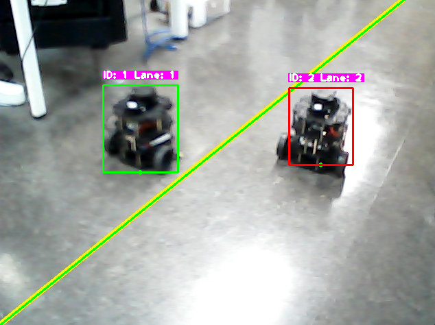

# 목차
### 1. [차선 분리](#차선-감지) | 2025.01.23
### 2. [사고감지](#deepsort) | 2025.01.24
### 3. [터틀봇 사고감지](#turtlebot3_deepsort_client_2) | 2025.01.27

---

### 차선 감지

final_project/lane_detect_addition_3.py를 실행시

하얀선은 차선으로 빨간색으로 표시

초록색 선은 각 선마다 번호를 부여

---

### Deepsort

사고난 차량 감지 시 해당 차량의 색을 빨간색으로 표시

이후에 정상적인 속도여도 지속적으로 빨간색으로 표시

---

### turtlebot3_deepsort_client_2

서버에 접속 (Client : CCTV)

터틀봇에 대해 Deepsort 처리를 하여 각 객체마다의 속도를 계산한 후 1.8 이하의 속도로 내려가면
그 이후의 속도에 무관하게 카메라에서는 빨간색 상자로 지속적으로 표시

화면에 빨간색 상자로 처리되는 객체가 존재하면 서버로 "Accident" 라는 문구를 전송

후에 빨간색 상자로 처리되는 객체가 하나도 존재하지 않을 시 "Normal"이라는 문구를 보냄

---

### turtlebot3_deepsort_lane_client

