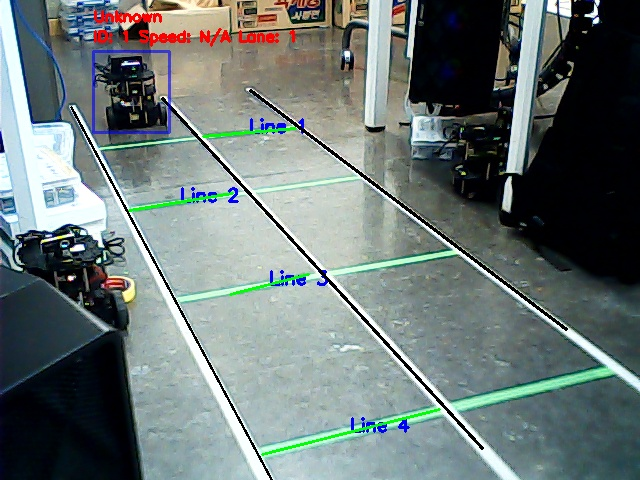
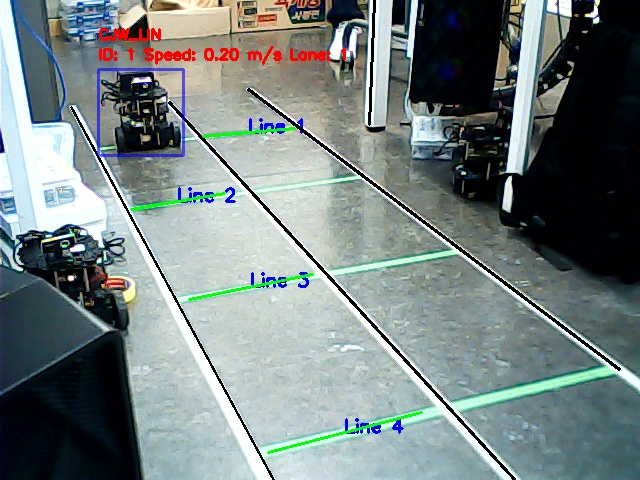

# AI 사고 감지 관제 시스템

- ### **[개요](#개요)**
- ### **[목표](#목표-1)**
- ### **[시스템 아키텍처](#시스템-아키텍처-1)**
- ### **[차선 구분](#lane-detection)**
- ### **[차량 정보](#차량-정보-1)**
    - #### **[차량 이름](#차량-구별)**
    - #### **[차량 속도](#차량-속도-계산)**

## 개요

- 이 프로젝트는 도로에서 여러 차량의 차선과 구간을 실시간으로 추적하여 각 차량의 사고 발생 여부를 판별합니다.

- Yolo 커스텀 모델과 OpenCV를 활용하여 차량의 위치와 속도를 정확히 계산하고, 속도가 갑자기 0으로 감소하면 이를 사고로 간주하여 즉시 알림을 보냅니다

- 교통사고에 빠르게 대응하고 사고를 예방할 수 있는 시스템을 구축합니다.

## 목표

- 교통사고 예방: 차량의 속도를 실시간으로 추적하고, 속도가 급격히 0으로 떨어지면 사고를 감지하여 빠르게 알림을 전송하여 사고를 예방하고 즉각적인 대응을 유도합니다.

- 효율적인 교통 관리: 도로의 차량 흐름을 모니터링하고, 교통사고와 같은 이상 상황을 빠르게 파악하여 교통 흐름을 효율적으로 관리합니다.

- 실시간 사고 대응: 사고가 발생한 경우 즉시 관제탑에 사고 알림을 전송하여 신속한 응급조치와 구조 활동을 지원합니다.

- 차량 위치 추적: 차량이 어느 차선과 구간에 있는지 정확히 파악하여 사고 발생 지점을 명확하게 알려줍니다.

## Lane Detection.py

- 바닥에 **하얀색 차선**과 **초록색 구간 구분선** 테이프를 차선과 구간을 구별

#### White Lane

- 차량의 주행 차선을 표시

#### Green Lane

- 주행 구간을 구분하는 역할을 하며, 50cm 간격으로 배치

#### 결과

- Gaussian blur 필터를 사용해 노이즈를 제거하고, HSV 색상 공간으로 변환하여 색 범위를 조정

- 윤곽선을 추출하고 선, 삼각형, 사각형으로 근사화하여 감지된 차선을 시각화

## 차량 정보

- ### 차량 구별

    - 차량이 선분을 지나갈 때마다 각 라인을 넘어갔다는 신호를 전달 (ex: [CJW_LIN]PASS@1)
    - 이를 전달 받아서 해당하는 차량에 고유 이름을 부여(CJW_LIN)

    

    
    
    

- ### 차량 속도 계산

    - 터틀봇 커스텀 모델을 사용하여 차량을 인식

    

    
    

    - 차량이 초록색 선분을 지나갈 때마다 현실 시간과 거리(50cm) 이용하여 속도를 계산

    

    
    

    - CCTV에서 각 차량의 차선, 구간, 속도 정보를 업데이트

    - 결과적으로 각 차량에는 차량이름, 속도, 차선, 구간

## 사고 감지

- 초록색 선분을 지나갔다는 정보가 일정 시간 감지되지 않으면 사고로 감지하여 빨간색 차량으로 표시

- 이때 전달 사항은 차선과 구간에 대한 정보 (ex:[CCTV#]ACCIDENT@(차선)@(구간))

